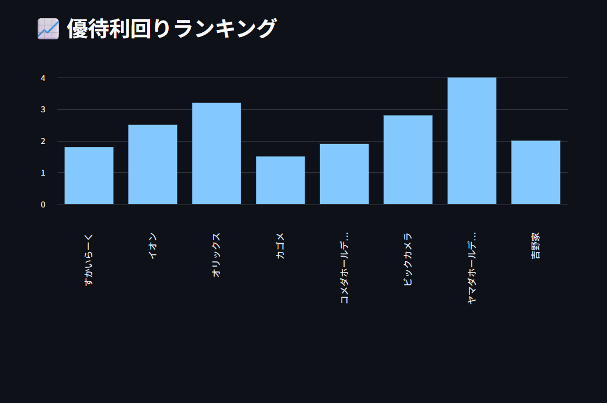
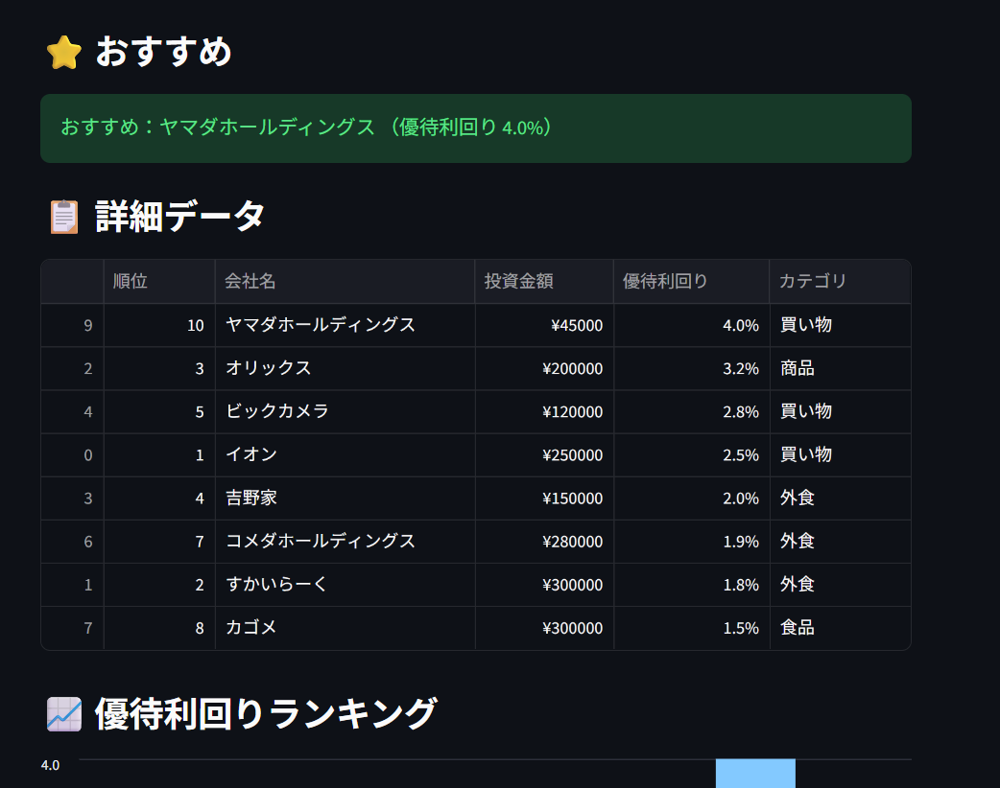
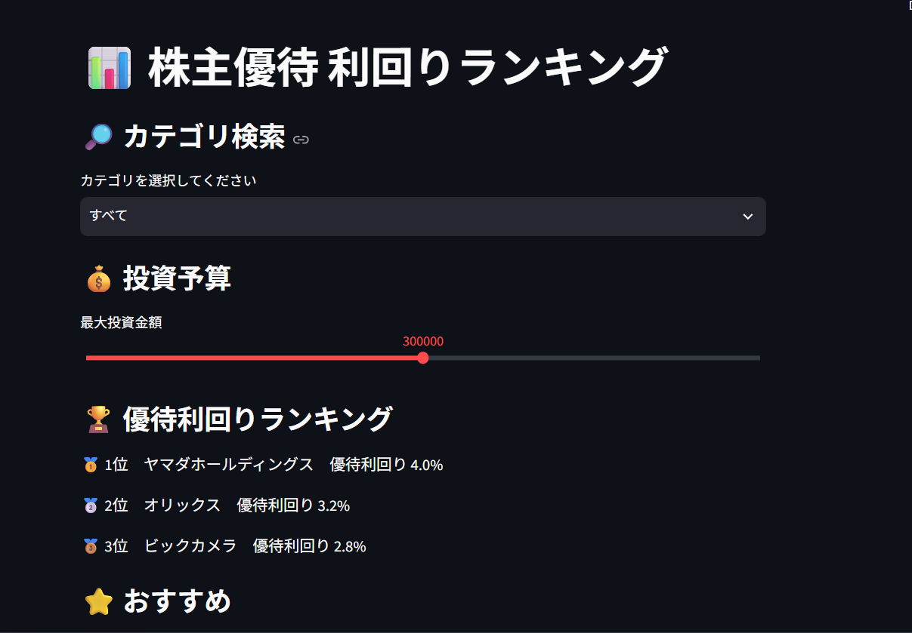

 📊 株主優待 利回りランキング

 概要

株主優待の利回りを、カテゴリや投資予算から検索・比較できるWebアプリです。

 開発目的

株主優待を探す際に、投資予算やカテゴリなどの条件から銘柄を絞り込み、
優待利回りの高い順に比較できるようにすることを目的として開発しました。

  主な機能

- カテゴリによる絞り込み
- 投資予算による絞り込み
- 優待利回りの高い順にランキング表示
- 1位〜3位の表示
- 条件に合う銘柄がない場合のメッセージ表示
- 詳細データの表示
- 優待利回りのグラフ表示

 アプリ画面

 使用技術

- Python
- Pandas
- Streamlit
- Git / GitHub

 工夫した点

ユーザーが条件を変更した際に、該当する銘柄を自動的に絞り込み、
優待利回りの高い順に表示できるようにしました。

また、条件に該当する銘柄がない場合にもエラーにならないよう、
メッセージを表示する処理を追加しました。

  今後追加したい機能

- 株価などのデータ更新
- より詳細な優待情報の表示
- 銘柄の比較機能
- データの自動更新
 
